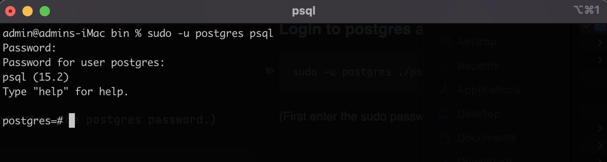
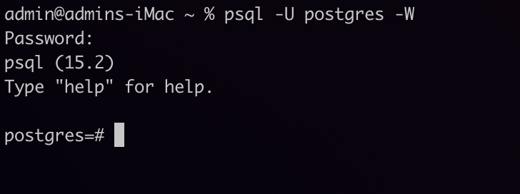
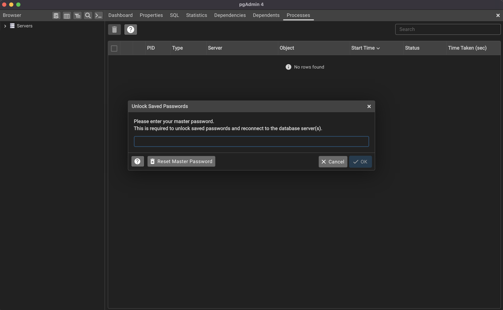
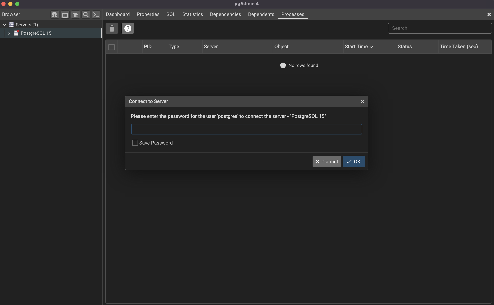
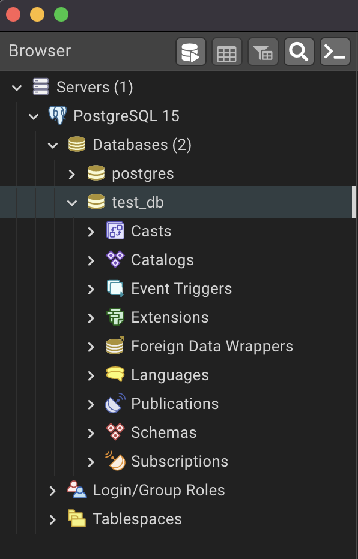

### **Log in to postgres and launch psql**

#### Using the terminal

```shell
sudo -u postgres psql
```

If using the above command: First enter the sudo password, then the postgres password.

If this is your first time using PostgreSQL, or you haven't used it for a while and are re-familiarizing yourself, keep the credentials simple:

- User: `postgres`
- Password: `postgres`



You can also specify both the `-U` and `-W` flags:

```shell
psql -U postgres -W
```




- The `-U` flag stands for the user
- The `-W` flag option requires you to provide the password

#### Using pgAdmin

Open the pgAdmin application and enter the user password.



Expand **Servers** in the **Browser** menu and enter the password when prompted.



To connect to one of the databases shown in the **Browser** menu, select (left-click) a database.


