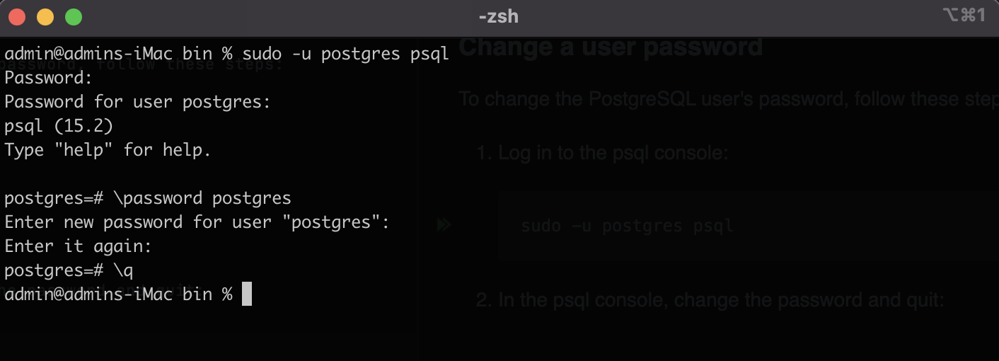

### **Change a user password**

To change the PostgreSQL user's password, follow these steps:

1. Log in to the psql console:

   ```shell
   sudo -u postgres psql
   ```
   
2. In the psql console, change the password and quit:

   <br />

   

   As you can see in the above screenshot, `\q` exits the psql console.

The current user's password can be changed by simply issuing

`\password`

in the psql console.