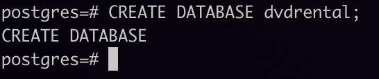
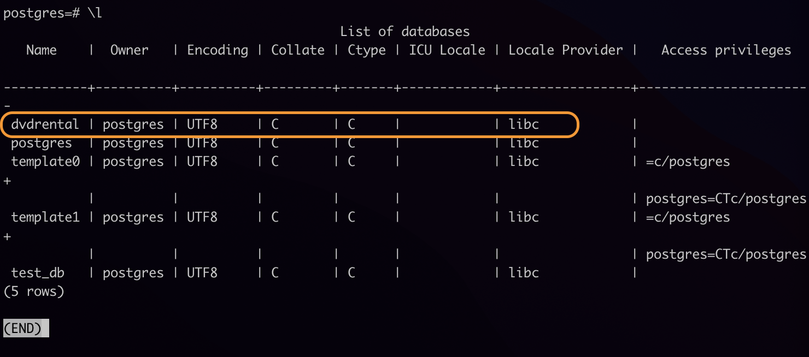
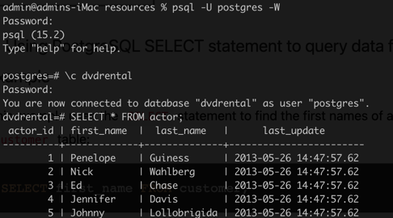

### **Load a database from an external data source**

1. Launch the `psql` tool and log in (refer to [Log in to postgres and launch `psql`](./001_log_in_to_psql.md)).

2. Enter the following `CREATE DATABASE` statement:
   
   `CREATE DATABASE db_name;`

   where `db_name` is the name of the database you will be importing.

   

3. List the databases to confirm that the new database has been created.

   

4. Exit `psql`:

   `\q`

   or

   `exit`

5. Navigate to the `bin` folder of the PostgreSQL installation folder.

   `cd /Library/PostgreSQL/15/bin`

6. In the `/resources` folder of this project, find the sample database `.zip` file: `dvdrental.zip`.

7. Run the command:

   `unzip "dvdrental.zip" -d data/ && mv "data/dvdrental/*" "data/" && rmdir "data/dvdrental"`

8. Use the `pg_restore` tool to load data into the new database you created with the `CREATE DATABASE` statement in _step 2_.

   `pg_restore -U postgres -d dvdrental /Users/admin/Documents/00_code-repos/postgresql-labs/resources/data/dvdrental.tar`

   In this command:
   - The `-U postgres` option specifies the `postgres` user to log in to the PostgreSQL database server.
   - The `-d dvdrental` specifies the target database to load.

   After running this command, you will be prompted for a password. Enter the `postgres` user password.

9. Connect to the new database and view its contents to verify that is properly imported.

   