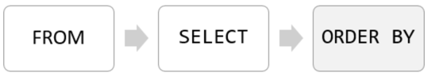
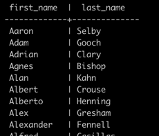
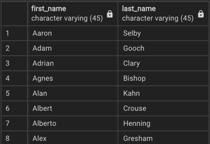
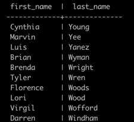
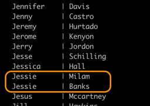
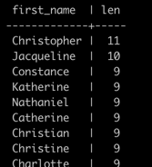
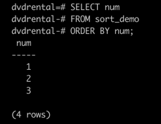
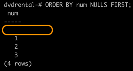
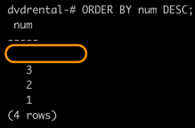
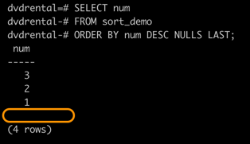

**Summary**

In this tutorial, you will learn how to sort the result set returned from the `SELECT` statement by using the **PostgreSQL ORDER BY** clause.

### Introduction to PostgreSQL ORDER BY clause

When you query data from a table, the `SELECT` statement returns rows in an unspecified order.
To sort the rows of the result set, you use the `ORDER BY` clause in the `SELECT` statement.

The `ORDER BY` clause allows you to sort rows returned by a `SELECT` clause in ascending or descending order based on a sort expression.

The following illustrates the syntax of the `ORDER BY` clause:

```sql
SELECT
   select_list
FROM
   table_name
ORDER BY
   sort_expression_1 [ASC | DESC],
   ...
   sort_expression_2 [ASC | DESC];
```

In this syntax:

- First, specify a sort expression, which can be a column or an expression, that you want to sort after the `ORDER BY` keywords.
If you want to sort the result set based on multiple columns or expressions, you need to place a comma (`,`) between two columns or expressions to separate them.
- Second, you use the `ASC` option to sort rows in ascending order and the `DESC` option to sort rows in descending order.
If you omit the `ASC` or `DESC` option, the `ORDER BY` uses `ASC` by default.

PostgreSQL evaluates the clauses in the `SELECT` statement in the following order: `FROM`, `SELECT`, and `ORDER BY`:



Due to the order of evaluation, if you have a column alias in the `SELECT` clause, you can use it in the `ORDER BY` clause.

Here are some examples of using the PostgreSQL `ORDER BY` clause.

### PostgreSQL `ORDER BY` examples

We will use the `customer` table in the `dvdrental` sample database for the demonstration.


#### **1) Example: Using PostgreSQL `ORDER BY` clause to sort rows by one column**

The following query uses the `ORDER BY` clause to sort customers by their first names in ascending order:

```sql
SELECT
   first_name,
   last_name
FROM
   customer
ORDER BY
   first_name ASC;
```



<br/>



Since the `ASC` option is the default, it can be omitted in the `ORDER BY` clause.

#### **2) Example: Using PostgreSQL `ORDER BY` clause to sort rows by one column in descending order**

```sql
SELECT
   first_name,
   last_name
FROM
   customer
ORDER BY
   last_name DESC;
```



#### **3) Example: Using PostgreSQL `ORDER BY` clause to sort rows by multiple columns**

The following statement selects the first name and last name from the customer table and sorts the rows by the first name in ascending order and last name in descending order:

```sql
SELECT
   first_name,
   last_name
FROM
   customer
ORDER BY
   first_name ASC,
   last_name DESC;
```



In this example, the `ORDER BY` clause sorts rows by values in the first name column first.
And then it sorts the sorted rows by values in the last name column.

#### **4) Example: Using PostgreSQL `ORDER BY` clause to sort rows by expressions**

The `LENGTH()` function accepts a string and returns the length of that string.

The following statement selects the first names and their lengths.
It sorts the rows by the lengths of the first names:

```sql
SELECT 
   first_name,
   LENGTH(first_name) len
FROM
   customer
ORDER BY 
   len DESC;
```



Because the `ORDER BY` clause is evaluated after the `SELECT` clause, the column alias `len` is available and can be used in the `ORDER BY` clause.

### **PostgreSQL `ORDERY BY` clause and `NULL`**

In the database world, `NULL` is a marker that indicates missing data, or that the data is unknown at the time of recording.

When you sort rows that contain `NULL`, you can specify the order of `NULL` with other non-null values by using the `NULLS FIRST` or `NULLS LAST` option of the `ORDER BY` clause:

`ORDER BY sort_expresssion [ASC | DESC] [NULLS FIRST | NULLS LAST]`

The `NULLS FIRST` option places `NULL` before other non-null values and the `NULLS LAST` option places `NULL` after other non-null values.

Creat a table for the demonstration:

```sql
-- create a new table
CREATE TABLE sort_demo(
   num INT
);

-- insert some data
INSERT INTO sort_demo(num)
VALUES(1),(2),(3),(null);
```

The following query returns data from the `sort_demo` table:

```sql
SELECT num
FROM sort_demo
ORDER BY num;
```



In this example, the `ORDER BY` clause sorts values in the num column of the `sort_demo` table in ascending order.

It places `NULL` after other values.

So if you use the `ASC` option, the `ORDER BY` clause uses the `NULLS LAST` option by default. Therefore, the following query returns the same result:

```sql
SELECT num
FROM sort_demo
ORDER BY num NULLS LAST;
```

To place `NULL` before other non-null values, you use the `NULLS FIRST` option:

```sql
SELECT num
FROM sort_demo
ORDER BY num NULLS FIRST;
```



The following statement sorts values in the `num` column of the `sort_demo` table in descending order:

```sql
SELECT num
FROM sort_demo
ORDER BY num DESC;
```



As you can see clearly from the output, the `ORDER BY` clause with the `DESC` option uses the `NULLS FIRST` by default.

To reverse the order, you can use the `NULLS LAST` option:

```sql
SELECT num
FROM sort_demo
ORDER BY num DESC NULLS LAST;
```



### Summary

- Use the `ORDER BY` clause in the `SELECT` statement to sort rows
- Use the `ASC` option to sort rows in ascending order and `DESC` option to sort rows in descending order. The `ORDER BY` clause uses the `ASC` option by default.
- Use `NULLS FIRST` and `NULLS LAST` options to explicitly specify the order of `NULL` with other non-null values.
