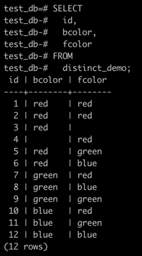
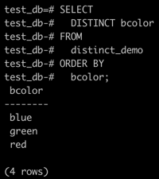
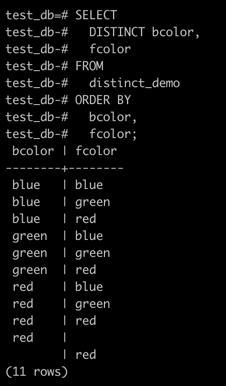
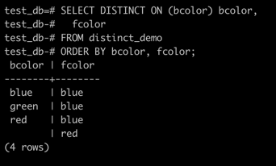

**Summary**

In this section, you will learn how to use the PostgreSQL `SELECT DISTINCT` clause to remove duplicate rows from a result set returned by a query.

### Introduction to PostgreSQL `SELECT DISTINCT` clause

The `DISTINCT` clause is used in the `SELECT` statement to remove duplicate rows from a result set.
The `DISTINCT` clause keeps one row for each group of duplicates.
The `DISTINCT` clause can be applied to one or more columns in the **select list** of the `SELECT` statement.

The following illustrates the syntax of the `DISTINCT` clause:

```sql
SELECT
  DISTINCT column1
FROM
  table_name;
```

In this statement, the values in the `column1` column are used to evaluate the duplicate.

If you specify multiple columns, the `DISTINCT` clause will evaluate the duplicate based on the combination of values of these columns.

```sql
SELECT
  DISTINCT column1, column2
FROM
  table_name;
```

In this case, the combination of values in both `column1` and `column2` columns will be used for evaluating the duplicate.

PostgreSQL also provides the `DISTINCT ON (expression)` to keep the "first" row of each group of duplicates using the following syntax:

```sql
SELECT
  DISTINCT ON (column1) column_alias
  column2
FROM
  table_name
ORDER BY
  column1
  column2;
```

The order of rows returned from the `SELECT` statement is unspecified therefore the "first" row of each group of the duplicate is also unspecified.

It is good practice to always use the `ORDER BY` clause with the `DISTINCT ON(expression)` to make the reuslt set predictable.

Notice that the `DISTINCT ON` expression must match the leftmost expression in the `ORDER BY` clause.

### Examples: PostgreSQL `SELECT DISTINCT`

Create a new table called `distinct_demo` and insert data into it for practicing the `DISTINCT` clause.

First, use the following `CREATE TABLE` statement to create the `distinct_demo` table that consists of three columns: `id`, `bcolor` and `fcolor`.

```sql
CREATE TABLE distinct_demo (
  id serial NOT NULL PRIMARY KEY,
  bcolor VARCHAR,
  fcolor VARCHAR
);
```

Second, insert some rows into the `distinct_demo` table using the following `INSERT` statement.

```sql
INSERT INTO distinct_demo (bcolor, fcolor)
VALUES
  ('red', 'red'),
  ('red', 'red'),
  ('red', NULL),
  (NULL, 'red'),
  ('red', 'green'),
  ('red', 'blue'),
  ('green', 'red'),
  ('green', 'blue'),
  ('green', 'green'),
  ('blue', 'red'),
  ('blue', 'green'),
  ('blue', 'blue');
```

Third, query data from the `distinct_demo` table using the `SELECT` statement:

```sql
SELECT
  id,
  bcolor,
  fcolor
FROM
  distinct_demo;
```



### Example: PostgreSQL `DISTINCT` one column

The following statement selects unique values in the `bcolor` column from the `t1`
table and sorts the result set in alphabetical order by using the `ORDER BY` clause.

```sql
SELECT
  DISTINCT bcolor
FROM
  distinct_demo
ORDER BY
  bcolor;
```



### Example: PostgreSQL `DISTINCT` multiple columns

The following statement demonstrates how to use the `DISTINCT` clause on multiple columns.

```sql
SELECT
  DISTINCT bcolor,
  fcolor
FROM
  distinct_demo
ORDER BY
  bcolor,
  fcolor;
```



Because we specified both `bcolor` and `fcolor` columns in the `SELECT DISTINCT` clause, PostgreSQL combined the values in both `bcolor` and `fcolor` columns to evaluate the uniqueness of the rows.

The query returns the unique combination of `bcolor` and `fcolor` from the `distinct_demo` table.
Notice that the `distinct_demo` table has two rows with `red` value in both `bcolor` and `fcolor` columns.
When we applied the `DISTINCT` keyword to both columns, one row was removed from the result set because it is the duplicate.

### Example: PostgreSQL `DISTINCT ON`

The following statement sorts the result set by the `bcolor` and `fcolor`, and then for each group of duplicates, it keeps the first row in the returned result set.

```sql
SELECT
  DISTINCT ON (bcolor) bcolor,
  fcolor
FROM
  distinct_demo
ORDER BY
  bcolor,
  fcolor;
```


