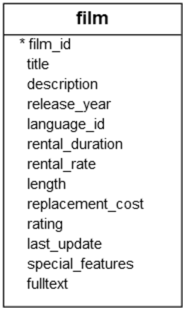
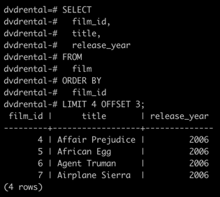
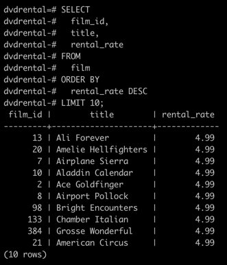

## PostgreSQL `LIMIT`

**Summary**: This section discusses how to use the `LIMIT` clause to get a subset of rows generated by a query.

### Introduction to PostgreSQL `LIMIT` clause

PostgreSQL `LIMIT` is an optional clause of the `SELECT` statement that constrains the number of rows returned by the query.

The following illustrates the syntax of the `LIMIT` clause:

```sql
SELECT select_list
FROM table_name
ORDER BY sort_expression
LIMIT row_count;
```

The statement returns `row_count` rows generated by the query.
If `row_count` is zero, the query returns an empty set.
In case `row_count` is `NULL`, the query returns the same result set as it does not have the `LIMIT` clause.

In case you want to skip a number of rows before returning the `row_count` rows, you can use the `OFFSET` clause placed after the `LIMIT` clause as the following statement:

```sql
SELECT select_list
FROM table_name
LIMIT row_count OFFSET num_rows_to_skip;
```

The statement first skips `num_rows_to_skip` rows before returning `row_count` rows generated by the query.
If `num_rows_to_skip` is zero, the statement will work like it doesn't have the `OFFSET` clause.

Because a table may store tows in an unspecified order, when you use the `LIMIT` clause, you should always use the `ORDER BY` clause to control the row order.
If you don't use the `ORDER BY` clause, you may get a result set with an unspecified order of rows.

### PostgreSQL `LIMIT` examples

Let's take some example of using the PostgreSQL `LIMIT` clause. We will use the `film` table in the `dvdrental` sample database for the demonstration.



#### 1) Example: Using PostgreSQL `LIMIT` to constrain the number of returned rows

This example uses the `LIMIT` clause to get the first five filims sorted by `film_id`:

```sql
SELECT
  film_id,
  title,
  release_year
FROM
  film
ORDER BY
  film_id
LIMIT 5;
```


#### 2) Example: Using PostgreSQL `LIMIT` with `OFFSET`

To retrieve 4 films starting from the fourth one ordered by `film_id`, you use both `LIMIT` and `OFFSET` clauses as follows:

```sql
SELECT
  film_id,
  title,
  release_year
FROM
  film
ORDER BY
  film_id
LIMIT 4 OFFSET 3;
```



#### 3) Example: Using PostgreSQL `LIMIT [ OFFSET ]` to get top / bottom N rows

Typically, you often use the `LIMIT` clause to select rows with the highest or lowest values from a table.

For example, to get the top 10 most expensive films in terms of rental, you sort films by the rental rate in descending order and use the `LIMIT` clause to get the first 10 films in the result.

The following query illustrates the idea:

```sql
SELECT
  film_id,
  title,
  rental_rate
FROM
  film
ORDER BY
  rental_rate DESC
LIMIT 10;
```

The result of the query is as follows:


