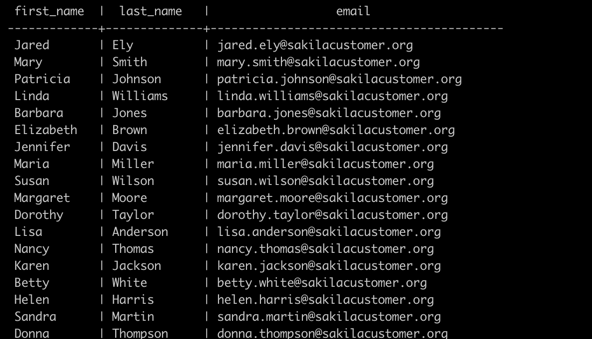
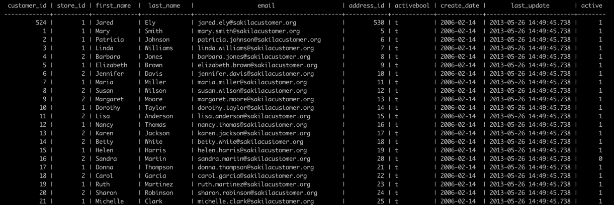
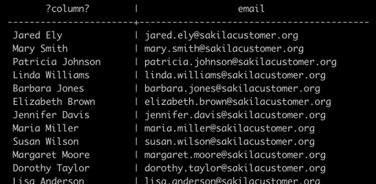
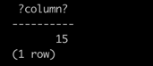

# PostgreSQL `SELECT`

The `SELECT` statement is one of the most complex statements in PostgreSQL.
It has many clauses that you can use to form a flexible query.

Because of its complexity, we will break it down into many shorter and easy-to-understand explanations so that you can learn about each clause faster.

The `SELECT` statement has the following clauses:

- Select distinct rows using the `DISTINCT` operator.
- Sort rows using `ORDER BY` clause.
- Filter rows using `WHERE` clause.
- Select a subset of rows from a table using `LIMIT` or `FETCH` clause.
- Group rows into groups using `GROUP BY` clause.
- Filter groups using `HAVING` clause.
- Join with other tables using join clauses such as
  - `INNER JOIN`
  - `LEFT JOIN`
  - `FULL OUTER JOIN`
  - `CROSS JOIN`
- Perform set operations using
  - `UNION`
  - `INTERSECT`
  - `EXCEPT`

This section focuses on discussing the `SELECT` and `FROM` clauses, which form the basis for most other queries.

## PostgreSQL `SELECT` statement syntax

Below is the basic form of the `SELECT` statement that retrieves data from a single table.

### Syntax of the `SELECT` statement:

```sql
SELECT
  select_list
FROM
  table_name;
```

- First, specify a select list that can be a column or a list of columns in a table from which you want to retrieve data.
  If you specify a list of columns, you need to place a comma (`,`) between two columns to separate them.
  If you want to select data from all the columns of the table, you can use an asterisk (`*`) shorthand instead of specifying all the column names.
  The select list may also contain expressions or literal values.
- Second, specify the name of the table from which you want to query data after the `FROM` keyword. The `FROM` clause is optional.
  If you do not query data from any table, you can omit the `FROM` clause in the `SELECT` statement.
  PostgreSQL evaluates the `FROM` clause before the `SELECT` clause in the `SELECT` statement

> **Note**: Case insensitivity
>
> Note that the SQL keywords are case-insensitive.
> This means that `SELECT` is equivalent to `select` or `Select`.
> By convention, we will use all the SQL keywords in uppercase to make the queries easier to read.

## PostgreSQL `SELECT` examples

Let's take a look at some examples of using PostgreSQL `SELECT` statement.

We will use the following `customer` table in the `dvdrental` sample database for the demonstration.


### 1. Example: Using PostgreSQL `SELECT` statement to query data from one column

This example uses the `SELECT` statement to find the first names of all customers from the `customer` table:

```sql
SELECT first_name FROM customer;
```

Here is the partial output:


Notice that we added a semicolon (`;`) at the end of the `SELECT` statement.
The semicolon is not a part of the SQL statement.
It is used to signal PostgreSQL the end of an SQL statement.
The semicolon is also used to separate two SQL statements.

### 2. Example: Using PostgreSQL `SELECT` statement to query data from multiple columns

Suppose you just want to know the first name, last name, and email of customers.
You can specify these column names in the `SELECT` clause as shown in the following query:

```sql
SELECT
  first_name, last_name, email
FROM
  customer;
```



### 3. Example: Using PostgreSQL `SELECT` statement to query data from all columns of a table

The following query uses the `SELECT` statement to select data from all columns of the customer table:

```sql
SELECT * FROM customer;
```



In this example, we used an asterisk (`*`) in the `SELECT` clause, which is a shorthand for all columns.
Instead of listing all columns in the `SELECT` clause, we just used the asterisk (`*`) to save some typing.

However, it is not a good practice to use the asterisk (`*`) in the `SELECT` statement when you embed SQL statements in application code like Python, Java, Node.js, or PHP due to the following reasons:

- **Database performance**. Suppose you have a table with many columns and a lot of data.
  The `SELECT` statement with the asterisk (`*`) shorthand will select data from all the columns of the table, which may not be necessary to the application.
- **Application performance**. Retrieving unnecessary data from the database increases the traffic between the database server and application server.
  In consequence, your applications may be slower to respond and less scalable.

Because of these reasons, it is a good practice to explicitly specify the column names in the `SELECT` clause whenever possible to get only necessary data from the database.

And you should only use the asterisk (`*`) shorthand for the ad-hoc queries that examine data from the database.

### 4. Example: PostgreSQL `SELECT` statement with expressions

The following example uses the `SELECT` statement to return full names and emails of all customers:

```sql
SELECT
  first_name || ' ' || last_name AS full_name,
  email
FROM
  customer;
```



In this example, we used the concatenation operator `||` to concatenate the first name, space, and last name of every customer.
This is an example of a _column alias_. Column aliases will be covered in more depth in the later sections.

### 5. Example: Using PostgreSQL `SELECT` statement with expressions

The following example uses the `SELECT` statement with an expression. It omits the `FROM` clause.

```sql
SELECT 5 * 3;
```

Here is the output:



---

In this section, you have learned how to use a basic form of the PostgreSQL `SELECT` statement to query data from a single table.
