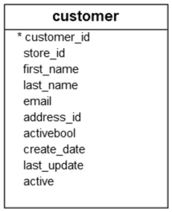
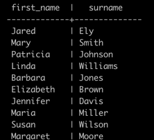
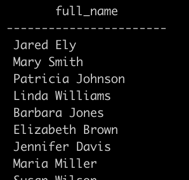
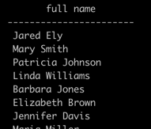

# Column Alias

This section discusses PostgreSQL _column aliases_ and how to use column aliases to assign temporary names to columns in queries.

## Introduction to the PostgreSQL Column Alias

A _column alias_ allows you to assign a temporary name to a column or an expression in the select list of a `SELECT` statement.
The _column alias_ exists temporarily during the execution of the query.

### Syntax

The following illustrates the syntax of using a _column alias_:

```sql
SELECT column_name AS alias_name
FROM table_name;
```

In this syntax, the `column_name` is assigned an alias `alias_name`.

The `AS` keyword is optional, so you can omit it like this:

```sql
SELECT column_name alias_name
FROM table_name;
```

The following syntax illustrates how to set an alias for an _expression_ in the `SELECT` clause:

```sql
SELECT expression AS alias_name
FROM table_name;
```

The main purpose of column aliases is to make the headings of the output of a query more meaningful.

### PostgreSQL column alias example

The `customer` table from the `dvdrental` sample database will be used to demonstrate how to work with column aliases.



### 1. Assigning a column alias to a column

```sql
SELECT 
  first_name, 
  last_name AS surname
FROM customer;
```

This query assigns `surname` as the alias of the `last_name` column:



Or you can make it shorter by removing the `AS` keyword as follows:

```sql
SELECT 
  first_name, 
  last_name surname
FROM customer;
```

### 2. Assigning an Alias to an Expression

Assign the expression `first_name || ' ' || last_name` a column alias, e.g., `full_name`:

```sql
SELECT
  first_name || ' ' || last_name AS full_name
FROM
  customer;
```



### 3. Example: Column aliases that contain spaces

If a column alias contains one or more spaces, you need to surround it with double quotes like this:

```sql
column_name AS "column alias"
```

For example:

```sql
SELECT
  first_name || ' ' || last_name "full name"
FROM
  customer;
```



## Summary

- Assign a column or an expression a column alias using the syntax `column_name AS alias_name` or `expression AS alias_name`.
- The `AS` keyword is optional.
- Use double quotes (`"`) to surround a column alias that contains spaces.
