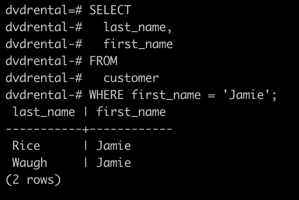
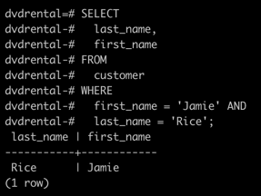
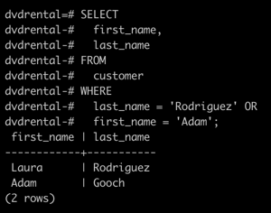
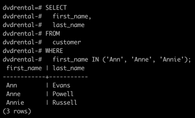
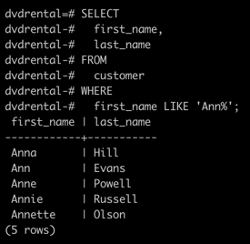
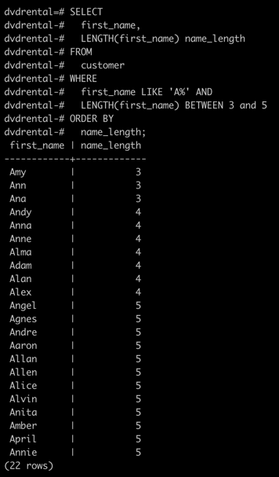
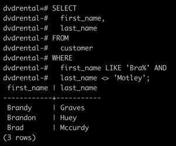

# PostgreSQL `WHERE`

**Summary**: This section discusses usage of the `WHERE` clause to filter rows returned by a `SELECT` statement.

The `SELECT` statement returns all rows from one or more columns in a table.
To select rows that satisfy a specified condition, you use a `WHERE` clause.

## Overview: PostgreSQL `WHERE` clause

The syntax of the PostgreSQL `WHERE` clause is as follows:

```sql
SELECT select_list
FROM table_name
WHERE condition
ORDER BY sort_expression;
```

The `WHERE` clause appears right after the `FROM` clause of the `SELECT` statement.
The `WHERE` clause uses the `condition` to filter the rows returned from the `SELECT` clause.

The `condition` must evaluate to true, false, or unknown.
It can be a boolean expression or a combination of boolean expressions using the `AND` and `OR` operators.

The query returns only rows that satisfy the `condition` in the `WHERE` clause.
In other words, only rows that cause the `condition` to evaluate to `true` will be included in the result set.

PostgreSQL evaluates the `WHERE` clause after the `FROM` clause and before the `SELECT` and `ORDER BY` clause:


If you use column aliases in the `SELECT` clause, you cannot use them in the `WHERE` clause.

Besides the `SELECT` statement, you can use the `WHERE` clause in the `UPDATE` and `DELETE` statements to specify rows to be updated or deleted.

To form the condition in the `WHERE` clause, you use comparison and logical operators.

| Operator     | Description                                         |
|--------------|-----------------------------------------------------|
| `=`          | Equal                                               |
| `>`          | Greater than                                        |
| `<`          | Less than                                           |
| `>=`         | Greater than or equal                               |
| `<=`         | Less than or equal                                  |
| `<>` or `!=` | Not equal                                           |
| `AND`        | Logical operator AND                                |
| `OR`         | Logical operator OR                                 |
| `IN`         | Return true if a value matches any value in a list  |
| `BETWEEN`    | Return true if a value is between a range of values |
| `LIKE`       | Return true if a value matches a pattern            |
| `IS NULL`    | Return true if a value is NULL                      |
| `NOT`        | Negate the result of other operators                |

## PostgreSQL `WHERE` clause examples

Let's practice with some examples of using the `WHERE` clause.
We will use a temporary test table similar to the `customer` table from the `dvdrental` sample database for demonstration.


### Setting Up a Temporary Test Database

To practice using the `WHERE` clause, we will create a temporary test database and a table called `test_customer`.

#### 1. Creating a Temporary Test Database

```sql
CREATE DATABASE testdb;
```

#### 2. Connecting to the Temporary Test Database

```bash
\c testdb
```

#### 3. Creating the `test_customer` Table and Inserting Data

```sql
CREATE TABLE test_customer (
  customer_id SERIAL PRIMARY KEY,
  first_name VARCHAR(45) NOT NULL,
  last_name VARCHAR(45) NOT NULL,
  email VARCHAR(255) UNIQUE NOT NULL,
  created_on TIMESTAMP DEFAULT CURRENT_TIMESTAMP
);

INSERT INTO test_customer (first_name, last_name, email) VALUES
('Jamie', 'Rice', 'jamie.rice@example.com'),
('Jamie', 'Smith', 'jamie.smith@example.com'),
('Adam', 'Rodriguez', 'adam.rodriguez@example.com'),
('Ann', 'Green', 'ann.green@example.com'),
('Anne', 'Brown', 'anne.brown@example.com'),
('Annie', 'White', 'annie.white@example.com'),
('Brad', 'Motley', 'brad.motley@example.com'),
('Brad', 'Pitt', 'brad.pitt@example.com');
```

### 1. Example: Using `WHERE` clause with the equal (`=`) operator

The following statement uses the `WHERE` clause to retrieve rows for customers whose first names are `Jamie`:

```sql
SELECT
  last_name,
  first_name
FROM
  customer
WHERE first_name = 'Jamie';
```



### 2. Example: Using `WHERE` clause with the `AND` operator

The following example finds customers whose first name and last name are `Jamie` and `Rice` by using the `AND` logical operator to combine two boolean expressions:

```sql
SELECT
  last_name,
  first_name
FROM
  customer
WHERE
  first_name = 'Jamie' AND
  last_name = 'Rice';
```



### 3. Example: Using `WHERE` clause with the `OR` operator

This example finds the customers whose last name is `Rodriguez` or first name is `Adam` by using the `OR` operator:

```sql
SELECT
  first_name,
  last_name
FROM
  customer
WHERE
  last_name = 'Rodriguez' OR
  first_name = 'Adam';
```



### 4. Example: Using the `WHERE` clause with the `IN` operator

If you want to match a string with any string in a list, you can use the `IN` operator.

For example, the following statement returns customers whose first name is `Ann`, or `Anne`, or `Annie`:

```sql
SELECT
  first_name,
  last_name
FROM
  customer
WHERE
  first_name IN ('Ann', 'Anne', 'Annie');
```



### 5. Example: Using the `WHERE` clause with the `LIKE` operator

To find a string that matches a specified pattern, you use the `LIKE` operator.
The following example returns all customers whose first names start with the string `Ann`:

```sql
SELECT
  first_name,
  last_name
FROM
  customer
WHERE
  first_name LIKE 'Ann%';
```



The `%` is called a wildcard that matches any string.
The `'Ann%'` pattern matches any string that starts with `Ann`.

### 6. Example: Using the `WHERE` clause with the `BETWEEN` operator

The following example finds customers whose first names start with the latter `A` and contains 3 to 5 characters by using the `BETWEEN` operator.

The `BETWEEN` operator returns true if a value is in a range of values.

```sql
SELECT
  first_name,
  LENGTH(first_name) name_length
FROM
  customer
WHERE
  first_name LIKE 'A%' AND
  LENGTH(first_name) BETWEEN 3 and 5
ORDER BY
  name_length;
```



In this example, we used the `LENGTH()` function to get the number of characters of an input string.

### 7. Example: Using the `WHERE` clause with the not equal operator (`<>`)

This example finds customers whose first names start with `Bra` and last names are not `Motley`:

```sql
SELECT
  first_name,
  last_name
FROM
  customer
WHERE
  first_name LIKE 'Bra%' AND
  last_name <> 'Motley';
```



Note that you can use the `!=` operator and `<>` operator interchangeably because they are equivalent.
