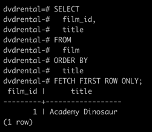
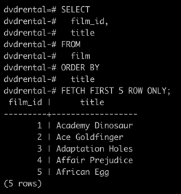
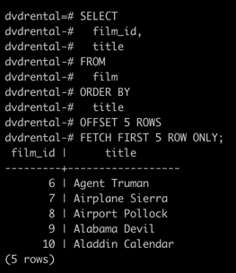

# PostgreSQL `FETCH`

**Summary**: This section describes how to use the PostgreSQL `FETCH` clause to retrieve a portion of rows returned by a query.

## Introduction to PostgreSQL `FETCH` clause

To constrain the number of rows returned by a query, you often use the `LIMIT` clause.
The `LIMIT` clause is widely used by many relational database management systems such as MySQL, H2, and HSQLDB.
However, the `LIMIT` clause is not a SQL-standard.

To conform with the SQL standard, PostgreSQL supports the `FETCH` clause to retrieve a number of rows returned by a query.
Note that the `FETCH` clause was introduced in SQL-2008.

The following illustrates the syntax of the PostgreSQL  `FETCH` clause:

```sql
OFFSET start { ROW | ROWS }
FETCH { FIRST | NEXT } [ row_count ] { ROW | ROWS } ONLY
```

In this syntax:

- `ROW` is the synonym for `ROWS`, `FIRST` is the synonym for `NEXT`.
  So you can use them interchangeably.
- The `start` is an integer that must be zero or positive.
  By default, it is zero if the `OFFSET` clause is not specified.
  In case thw `start` is greater than the number of rows in the result set, no rows are returned.
- The `row_count` is 1 or greater. By default, the default value of `row_count` is 1 if you do not specify it explicitly.

Because the order of rows stored in the table is unspecified, you should always use the `FETCH` clause with the `ORDER BY` clause to make the order of rows in the returned result set consistent.

Note that the `OFFSET` clause must come before the `FETCH` clause in SQL 2008.
However, `OFFSET` and `FETCH` clauses can appear in any order in PostgreSQL.

## `FETCH` vs. `LIMIT`

The `FETCH` clause is functionally equivalent to the `LIMIT` clause.
If you plan to make your application compatible with other database systems, you should use the `FETCH` clause because it follows the standard SQL.

## PostgreSQL `FETCH` examples

Let's use the `film` table in the `dvdrental` sample database for the demonstration.


### Example 1: Using PostfreSQL `FETCH` to Select the First Row

The following query uses thw `FETCH` clause to select the first film sorted by titles in ascending order:

```sql
SELECT
  film_id,
  title
FROM
  film
ORDER BY
  title
FETCH FIRST ROW ONLY;
```



The above query is equivalent to the following query:

```sql
SELECT
  film_id,
  title
FROM
  film
ORDER BY
  title
FETCH FIRST 1 ROW ONLY;
```

### Example 2: Using PostgreSQL `FETCH` to Select the First Five Rows

The following query uses the `FETCH` clause to select the first five films sorted by title:

```sql
SELECT
  film_id,
  title
FROM
  film
ORDER BY
  title
FETCH FIRST 5 ROWS ONLY;
```



### Example 3: Using PostgreSQL `FETCH` with `OFFSET`

The following statement returns the next five films after the first five films sorted by titles:

```sql
SELECT
  film_id,
  title
FROM
  film
ORDER BY
  title
OFFSET 5 ROWS
FETCH NEXT 5 ROWS ONLY;
```


