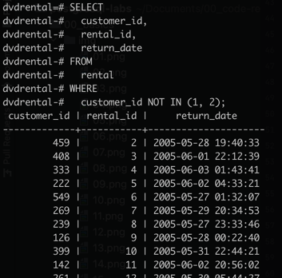
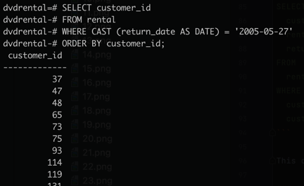
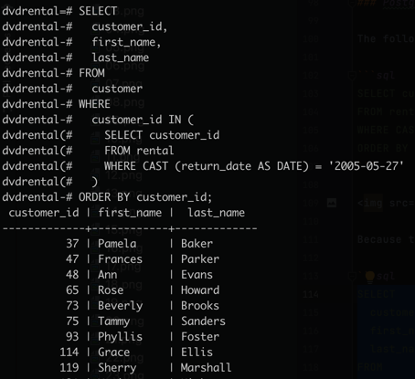

# PostgreSQL `IN`

**Summary**: This section discusses how to use the PostgreSQL `IN` operator in the `WHERE` clause to check if a value matches any value in a list.

## PostgreSQL `IN` Operator Syntax

You use `IN` in the `WHERE` clause to check if a value matches any value in a list of values.

### Syntax of the `IN` Operator

```sql
value IN (valie_1, value_2, ..., value_n)
```

The `IN` operator returns true if the `value` matches any value in the list, i.e., `value_1, value_2, ..., value_n`.

The list of values can be a list of literal values such as numbers, strings, or a result of a `SELECT` statement like this:

```sql
value IN (SELECT solumn_name FROM table_name);
```

The query inside the parentheses is called a subquery, which is a query nested inside another query.

## PostgreSQL `IN` operator examples

### Example 1: Using the `IN` Operator

Suppose you want to know the rental information of customer id **1** and **2**.
You can use the `IN` operator in the `WHERE` clause as follows:

```sql
SELECT
  customer_id,
  rental_id,
  return_date
FROM
  rental
WHERE
  customer_id IN (1, 2)
ORDER BY
  return_date DESC;
```


This query is shorter and more readable than using the equal (`=`) and `OR` operators:

```sql
SELECT
  rental_id,
  customer_id,
  return_date
FROM
  rental
WHERE
  customer_id = 1 OR customer_id = 2
ORDER BY
  return_date DESC;
```

PostgreSQL executes the query with the `IN` operator faster than the same query that uses a list of `OR` operators.

### Example 2: Using the `NOT IN` Operator

You can combine the `IN` operator with the `NOT` operator to select rows whose values do not match the values in the list.
For example, the following statement finds all rentals with the `customer_id` that is not **1** or **2**.

```sql
SELECT
  customer_id,
  rental_id,
  return_date
FROM
  rental
WHERE
  customer_id NOT IN (1, 2);
```



This query us equivalent to using the not equal (`<>`) and `AND` operators:

```sql
SELECT
  customer_id,
  rental_id,
  return_date
FROM
  rental
WHERE
  customer_id <> 1 AND
  customer_id <> 2;
```

### Example 3: Using the `IN` Operator with a Subquery

The following query returns a list of customer ids from the `rental` table with the return date equal to `2005-05-27`:

```sql
SELECT customer_id
FROM rental
WHERE CAST (return_date AS DATE) = '2005-05-27'
ORDER BY customer_id;
```



Because this query returns a list of values, you can use it as the input of the `IN` operator like this:

```sql
SELECT
  customer_id,
  first_name,
  last_name
FROM
  customer
WHERE
  customer_id IN (
    SELECT customer_id
    FROM rental
    WHERE CAST (return_date AS DATE) = '2005-05-27'
  )
ORDER BY customer_id;
```


