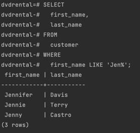
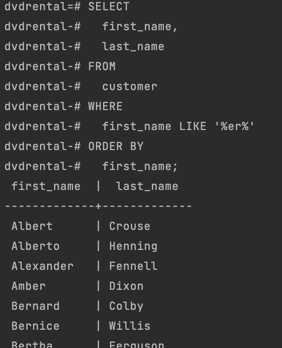
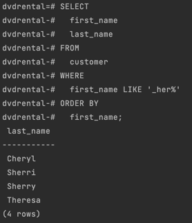
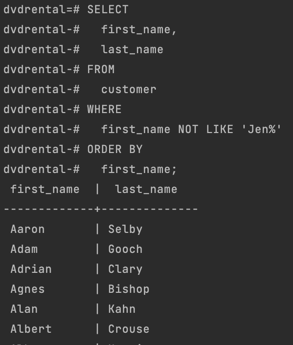
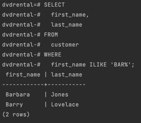

# PostgreSQL `LIKE` Operator

**Summary**: This section describes how to use the PostgreSQL `LIKE` ans `ILIKE` operators to query data using pattern matching.

## Introduction to the PostgreSQL `LIKE` Operator

Suppose that you want to find a customer but you do not remember her name exactly.
However, you just remember that her name begins with something like `Jen`.

How do you find the exact customer from the database?
You may find the customer in the `customer` table by looking at the first name column to see if there is any value that begins with `Jen`.
It will be time-consuming if the customer table has many rows.

You can use the PostgreSQL `LIKE` operator to match the first name of the customer with a string like this query:

```sql
SELECT
  first_name,
  last_name
FROM
  customer
WHERE
  first_name LIKE 'Jen%';
```



Notice that the `WHERE` clause contains a special expression: the `first_name`, the `LIKE` operator and a string that contains a percent sign (`%`).
The string `Jen%` is called a **pattern**.

The query returns rows whose values in the `first_name` column begin with `Jen` and may be followed by any sequence of characters.
This technique is called **_pattern matching_**.

You construct a pattern by combining literal values with wildcard characters and use the `LIKE` and `NOT LIKE` operator to find the matches.
PostgreSQL provides you with two wildcards.

- **Percent sign** (`%`) matches any sequence of zero or more characters.
- **Underscore sign** (`_`) matches any single character.

The syntax of PostgreSQL `LIKE` operator is as follows:

### Syntax of the PostgreSQL `LIKE` Operator

```sql
value LIKE pattern
```

The expression returns true if the `value` matches the `pattern`.

To negate the `LIKE` operator, you use the `NOT` operator as follows:

```sql
value NOT LIKE pattern
```

The `NOT LIKE` operator returns true when the `value` does not match the `pattern`.

If the pattern does not contain any wildcard character, the `LIKE` operator behaves like the equal (`=`) operator.

## PostgreSQL `LIKE` Operator - Pattern Matching Examples

Let's take some examples of using the `LIKE` operator.

### Example 1: Basic `LIKE` Operator Usage

See the following example:

```sql
SELECT
   'foo' LIKE 'foo',  -- true
   'foo' LIKE 'f%',   -- true
   'foo' LIKE '_o_',   -- true
   'bar' LIKE 'b_';   -- false
```

- The first expression returns true because the `foo` pattern does not contain any wildcard character so the `LIKE` operator acts like the equal (`=`) operator.
- The second expression returns true because it matches any string that begins with the letter `f` followed by any number of characters.
- The third expression returns true because the pattern (`_o_`) matches any string that begins with any single character, followed by the letter `o` and ends with any single character.
- The fourth expression returns false because the pattern `b_` matches any string that begins with the letter `b`, followed by any single character.

It's possible to use wildcards at the beginning and/or end of the pattern.

For example, the following query returns customers whose first name contains a string `er`, like `Jenifer`, `Kimberly`, etc.

```sql
SELECT
  first_name,
  last_name
FROM
  customer
WHERE
  first_name LIKE '%er%'
ORDER BY
  first_name;
```



You can combine the percent (`%`) with underscore (`_`) to construct a pattern as the following example:

```sql
SELECT
  first_name
  last_name
FROM
  customer
WHERE
  first_name LIKE '_her%'
ORDER BY
  first_name;
```



The pattern `_her%` matches any string that:

- Beings with any single character (`_`)
- And is followed by the literal string `her`.
- And is ended with any sequence of characters.

The returned first names are C**her**yl, S**her**ri, S**her**ry, and T**her**esa.

### PostgreSQL `NOT LIKE` Operator Usage

The following query uses the `NOT LIKE` operator to find customers whose first names do not being with `Jen`:

```sql
SELECT
  first_name,
  last_name
FROM
  customer
WHERE
  first_name NOT LIKE 'Jen%'
ORDER BY
  first_name;
```



## PostgreSQL extensions of `LIKE` operator

PostgreSQL supports the `ILIKE` operator that works like the `LIKE` operator.
In addition, the `ILIKE` operator matches a value case-insensitively. For example:

```sql
SELECT
  first_name,
  last_name
FROM
  customer
WHERE
  first_name ILIKE 'BAR%';
```



The `BAR%` pattern matches any string that begins with `BAR`, `Bar`, `BaR`, etc.
If you use the `LIKE` operator instead, the query will not return any row.

PostgreSQL also provides some operators that act like the `LIKE`, `NOT LIKE`, `ILIKE`, and `NOT ILIKE` operator as shown below:

| Operator | Equivalent  |
|----------|-------------|
| `~~`     | `LIKE`      |
| `~~*`    | `ILIKE`     |
| `!~~`    | `NOT LIKE`  |
| `!~~*`   | `NOT ILIKE` |
