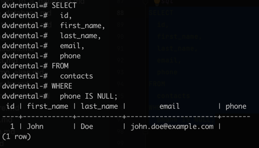
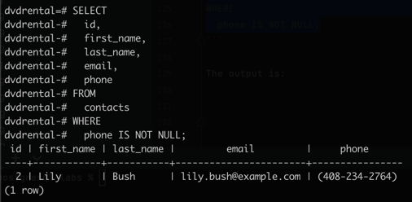

# PostgreSQL `IS NULL` Operator

**Summary**: This section discusses how to use the PostgreSQL `IS NULL` operator to check if a value is `NULL` or not.

## Introduction to the `NULL` and `IS NULL` operators

In the database world, `NULL` means missing information or not applicable.
`NULL` is not a value, therefore you cannot compare it with any other values like numbers or strings.
The comparison of `NULL` with a value will always result in `NULL`, which means an unknown result.

In addition, `NULL` is not equal to `NULL` so the following expression returns `NULL`:

```
NULL = NULL
```

Assume that you have a `contacts` table that stores the first name, last name, email, and phone number of contacts.
At the time of recording the contact, you may not know the contact's phone number.
To deal with this, you define the `phone` column as a nullable column and insert `NULL` into the `phone` column when you save the contact information.

```sql
CREATE TABLE contacts(
  id INT GENERATED BY DEFAULT AS IDENTITY,
  first_name VARCHAR(50) NOT NULL,
  last_name VARCHAR(50) NOT NULL,
  email VARCHAR(255) NOT NULL,
  phone VARCHAR(15),
  PRIMARY KEY (id)
);
```

> Learn how to create a new table in the <a href="008_create_a_table.md">Create a table</a> section.
> 
> For now, just execute the above statement to create the `contacts` table.

If you get an error while executing the `CREATE TABLE` statement, your PostgreSQL version may not support the identity column syntax.
In this case, you can use the following statement to create the table:

```sql
CREATE TABLE contacts(
  id SERIAL,
  first_name VARCHAR(50) NOT NULL,
  last_name VARCHAR(50) NOT NULL,
  email VARCHAR(255) NOT NULL,
  phone VARCHAR(15),
  PRIMARY KEY (id)
);
```

The following statement inserts two contacts. One has a phone number and the other does not.

```sql
INSERT INTO contacts(first_name, last_name, email, phone)
VALUES ('John', 'Doe', 'john.doe@example.com', NULL),
       ('Lily', 'Bush', 'lily.bush@example.com', '(408-234-2764)');
```

To find the contact who does not have a phone number you may come up with the following statement:

```sql
SELECT
  id,
  first_name,
  last_name,
  email,
  phone
FROM
  contacts
WHERE
  phone = NULL;
```

The statement returns no row. This is because the expression `phone = NULL` in the `WHERE` clause always returns `false`.
Even though there is a `NULL` in the phone column, the expression `NULL = NULL` returns `false`.
This is because `NULL` is not equal to any value, even itself.

To check whether a value is `NULL` or not, you can use the `IS NULL` operator instead:

```
value IS NULL
```

The expression returns `true` if the value is `NULL`, or `false` if it is not.

So to get the contact who does not have any phone number stored in the phone column, you can use the following statement instead:

```sql
SELECT
  id,
  first_name,
  last_name,
  email,
  phone
FROM
  contacts
WHERE
  phone IS NULL;
```

Here is the output:



## PostgreSQL `IS NOT NULL` operator

To check if a value is **_not_** `NULL`, you use the `IS NOT NULL` operator:

```
value IS NOT NULL
```

The expression returns `true` if the value is not `NULL` or false if the value is `NULL`.

For example, to find the contact who does have a phone number, you use the following statement:

```sql
SELECT
  id,
  first_name,
  last_name,
  email,
  phone
FROM
  contacts
WHERE
  phone IS NOT NULL;
```

The output is:


