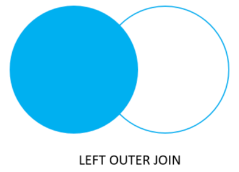
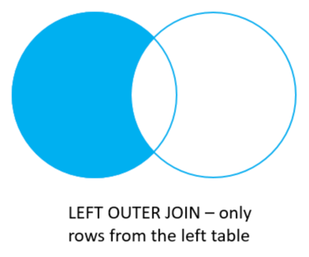
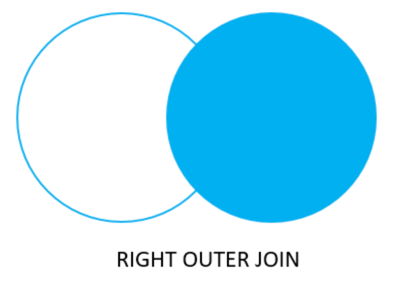
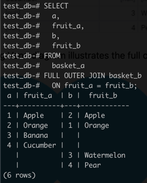
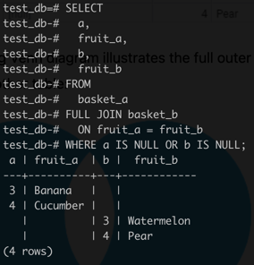

# PostgreSQL Joins

**Summary**: The sections discusses various kinds of PostgreSQL join operations including:

- inner join
- left join
- right join
- full outer join
- cross join
- natural join
- self-join

PostgreSQL join is used to combine columns from one (self-join) or more tables based on the values of the common columns between related tables.
The common columns are typically the primary key columns of the first table and the foreign key columns of the second table.
PostgreSQL supports the following join operations:

- inner join
- left join
- right join
- full outer join
- cross join
- natural join
- self-join

## Setting Up the Sample Tables

To practice using joins, we will create a temporary test database and tables called `basket_a` and `basket_b` that store fruits.

### Creating a Temporary Test Database

```sql
CREATE DATABASE testdb;
```

```bash
\c testdb
```

### Creating the `basket_a` and `basket_b` Tables and Inserting Data

Suppose you have two tables called `basket_a` and `basket_b` that store fruits:

### Creating the Tables

```sql
CREATE TABLE basket_a (
  a INT PRIMARY KEY,
  fruit_a VARCHAR (100) NOT NULL
);

CREATE TABLE basket_b (
  b INT PRIMARY KEY,
  fruit_b VARCHAR (100) NOT NULL
);
```

### Inserting Data

```sql
INSERT INTO basket_a (a, fruit_a)
VALUES
  (1, 'Apple'),
  (2, 'Orange'),
  (3, 'Banana'),
  (4, 'Cucumber');
  
INSERT INTO basket_b (b, fruit_b)
VALUES
  (1, 'Orange'),
  (2, 'Apple'),
  (3, 'Watermelon'),
  (4, 'Pear');
```

Notice that the tables have some common fruits such as `apple` and `orange`.

### Confirming the Data

Confirm that the following statement returns the expected data from the `basket_a` table:

```sql
SELECT * FROM basket_a;
```


Confirm that the following statement returns the expected data from the `basket_b` table:

```sql
SELECT * FROM basket_b;
```


## PostgreSQL Inner Join

The following statement joins the first table (`basket_a`) with the second table (`basket_b`) by matching the values in the `fruit_a` and `fruit_b` columns.

```sql
SELECT
  a,
  fruit_a,
  b,
  fruit_b
FROM
  basket_a
INNER JOIN basket_b
  ON fruit_a = fruit_b;
```


The **inner join** examines each row in the first table (`basket_a`).
It compares the value in the `fruit_a` column of each row in the second table (`basket_b`).
If these values are equal, the inner join creates a new row that contains columns from both tables and adds this new row to the result set.
The following Venn diagram illustrates the inner join:


## PostgreSQL Left Join

The following statement uses the `LEFT JOIN` clause to join the `basket_a` table with the `basket_b` table.
In the left join context, the first table is called the **left table** and the second table is called the **right table**.

```sql
SELECT
  a,
  fruit_a,
  b,
  fruit_b
FROM
  basket_a
LEFT JOIN basket_b
  ON fruit_a = fruit_b;
```


The left join starts selecting data from the left table.
It compares values in the `fruit_a` column with the values in the `fruit_b` column in the `basket_b` table.

If these values are equal, the left join creates a new row that contains columns of both tables and adds this new row to the result set.
(See row #1 and row #2 in the result set.

In case the values are not equal, the left join also creates a new row that contains columns from both tables and adds it to the result set.
However, it fills the columns of the right table (`basket_b`) with `NULL`.
(See row #3 and row #4 in the result set.)

The following Venn diagram illustrates the left join:



To select rows from the left table that do not have matching rows in the right table, you use the left join with a `WHERE` clause. For example:

```sql
SELECT
  a,
  fruit_a,
  b
  fruit_b
FROM
  basket_a
LEFT JOIN basket_b
  ON fruit_a = fruit_b
WHERE b IS NULL;
```


<blockquote>
Note that the <code>LEFT JOIN</code> is the same as the <code>LEFT OUTER JOIN</code> so you can use them interchangeably.
</blockquote>

The following Venn diagram illustrates the left join that returns rows from the left table which do now have matching rows from the right table:



## PostgreSQL right join

The right join is a reversed version of the left join.
The right join starts selecting data from the right table.
It compares each value in the `fruit_b` column of every row in the right table (`basket_b`) with each value in the `fruit_a` column of every row in the left table (`basket_a`).

If these values are equal, the right join creates a new row that contains columns from both tables.

In case these values are not equal, the right join also creates a new row that contains columns from both tables.
However, it fills the columns in the left table with `NULL`.

The following statement uses the right join to join the `basket_a` table with the `basket_b` table.

```sql
SELECT
  a,
  fruit_a,
  b,
  fruit_b
FROM
  basket_a
RIGHT JOIN basket_b ON fruit_a = fruit_b;
```

Here is the output:


The following Venn diagram illustrates the right join:



Similarly, you can get rows from the right table that do not have matching rows from the left table by adding a `WHERE` clause as follows:

```sql
SELECT
  a,
  fruit_a,
  b,
  fruit_b
FROM
  basket_a
RIGHT JOIN basket_b
  ON fruit_a = fruit_b
WHERE a IS NULL;
```


> The `RIGHT JOIN` and `RIGHT OUTER JOIN` are the same therefore you can use them interchangeably.

The following Venn diagram illustrates the right join that returns rows from the right table that do not have matching rows in the left table.


## PostgreSQL full outer join

The full outer join or full join returns a result set that contains all rows from both left and right tables, with the matching rows from both sides if available.
In case there is no match, the columns of the table will be filled with `NULL`.

```sql
SELECT
  a,
  fruit_a,
  b,
  fruit_b
FROM
  basket_a
FULL OUTER JOIN basket_b
  ON fruit_a = fruit_b;
```

Output:



The following Venn diagram illustrates the full outer join:


To return rows in a table that do not have matching rows in the other, you use the full join with a `WHERE` clause:

```sql
SELECT
  a,
  fruit_a,
  b,
  fruit_b
FROM
  basket_a
FULL JOIN basket_b
  ON fruit_a = fruit_b
WHERE a IS NULL OR b IS NULL;
```



The following Venn diagram illustrates the full outer join that returns rows from a table that do not have the corresponding rows in the other table.


The following picture shows all the PostgreSQL joins discussed so far with the detailed syntax:


