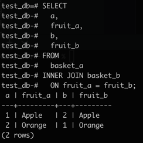

# PostgreSQL Inner Join

The following statement joins the first table (`basket_a`) with the second table (`basket_b`) by matching the values in the `fruit_a` and `fruit_b` columns.

```sql
SELECT
  a,
  fruit_a,
  b,
  fruit_b
FROM
  basket_a
INNER JOIN basket_b
  ON fruit_a = fruit_b;
```



The **inner join** examines each row in the first table (`basket_a`).
It compares the value in the `fruit_a` column of each row in the second table (`basket_b`).
If these values are equal, the inner join creates a new row that contains columns from both tables and adds this new row to the result set.
The following Venn diagram illustrates the inner join:


