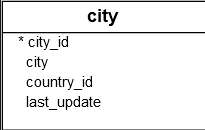

# PostgreSQL `NATURAL JOIN`

https://www.postgresqltutorial.com/postgresql-tutorial/postgresql-natural-join/

**Summary**: In this section, you will learn how to use PostgreSQL `NATURAL JOIN` to query data from two tables.

## Introduction to PostgreSQL `NATURAL JOIN` Clause

A natural join is a join that creates an implicit join based on the same column names in the joined tables.

The following shows the syntax of the PostgreSQL `NATURAL JOIN` clause:

```sql
SELECT select_list
FROM table1
NATURAL [INNER, LEFT, RIGHT] JOIN table 2;
```

In this syntax:
- First specify columns from the tables from which you want to retrieve data in the `select_list` in the `SELECT` clause.
- Second, provide the main table (`table1`) from which you want to retrieve data.
- Third, specify the table (`table2`) that you want to join with the main table, in the `NATURAL JOIN` clause.

A natural join can be an inner join, left join, or right join.
If you do no specify an explicit join, PostgreSQL will use the `INNER JOIN` by default.

The convenience of the `NATURAL JOIN` is that it does not require you to specify the condition in the join clause because it uses an implicit condition based on the equality of the common columns.

The equivalent of the `NATURAL JOIN` will be like tihs:

```sql
SELECT select_list
FROM table1
[INNER, LEFT, RIGHT] JOIN table2 ON table1.column_name = table2.column_name;
```

## Inner Join

The following statements are equivalent:

```sql
SELECT select_list
FROM table1
NATURAL INNER JOIN table2;
```

And

```sql
SELECT select_list
FROM table1
INNER JOIN table2 USING (column_name);
```

## Left Join

The following statements are equivalent:

```sql
SELECT select_list
FROM table1
NATURAL LEFT JOIN table2;
```

And

```sql
SELECT select_list
FROM table1
LEFT JOIN table2 USING (column_name);
```

## Right Join

The following statements are equivalent:

```sql
SELECT select_list
FROM table1
NATURAL RIGHT JOIN table2;
```

And

```sql
SELECT select_list
FROM table1
RIGHT JOIN table2 USING (column_name);
```

## Setting Up Sample Tables

The following statements create `categories` and `products` tables, and insert sample data for the demonstration:

```sql
CREATE TABLE categories (
    category_id SERIAL PRIMARY KEY,
    category_name VARCHAR(255) NOT NULL
);

CREATE TABLE products (
    product_id SERIAL PRIMARY KEY,
    product_name VARCHAR(255) NOT NULL,
    category_id INT NOT NULL,
    FOREIGN KEY (category_id) REFERENCES categories (category_id)
);

INSERT INTO categories (category_name)
VALUES
    ('Smartphone'),
    ('Laptop'),
    ('Tablet'),
    ('VR')
RETURNING *;

INSERT INTO products (product_name, category_id)
VALUES
    ('iPhone', 1),
    ('Samsung Galaxy', 1),
    ('HP Elite', 2),
    ('Lenovo Thinkpad', 2),
    ('iPad', 3),
    ('Kindle Fire', 3)
RETURNING *;
```

The `products` table has the following data:

> Place screenshot here

The `categories` table has the following data:

> Place screenshot here

## PostgreSQL `NATURAL JOIN` Examples

Let's explore some examples of using the `NATURAL JOIN` statement.

### 1. Basic PostgreSQL `NATURAL JOIN` Example

The following statement uses the `NATURAL JOIN` clause to join the `products` table with the `categories` table.

```sql
SELECT *
FROM products
NATURAL JOIN categories;
```

This statement performs an inner join using the `category_id` column.

Output:

> Place screenshot here

This statement is equivalent to the following statement that uses the `INNER JOIN` clause:

```sql
SELECT *
FROM products
INNER JOIN categories USING (category_id);
```

### 2. Using PostgreSQL `NATURAL JOIN` to Perform a `LEFT JOIN`

The following example uses the `NATURAL JOIN` clause to perform a `LEFT JOIN` without specifying the matching column:

```sql
SELECT *
FROM categories
NATURAL LEFT JOIN products;
```

Output:

> Place screenshot here

### 3. Example of using PostgreSQL `NATURAL JOIN` that causes an unexpected result

In practice, you should avoid using the `NATURAL JOIN` whenever possible because sometimes it may cause an unexpected result.

Consider the following `city` and `country` tables from the sample database:




Both tables have the same `country_id` column so you can use the `NATURAL JOIN` to join these tables as follows:

```sql
SELECT *
FROM city
NATURAL JOIN country;
```

The query returns an empty result set.

The reason is that both tables have another common column called `last_update`.
When the `NATURAL JOIN` clause uses the `last_update` column, it does not find any matches.

## Summary

Use the PostgreSQL `NATURAL JOIN` clause to query data from two or more tables that have common columns.
