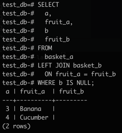

# PostgreSQL Left Join

The following statement uses the `LEFT JOIN` clause to join the `basket_a` table with the `basket_b` table.
In the left join context, the first table is called the **left table** and the second table is called the **right table**.

```sql
SELECT
  a,
  fruit_a,
  b,
  fruit_b
FROM
  basket_a
LEFT JOIN basket_b
  ON fruit_a = fruit_b;
```


The left join starts selecting data from the left table.
It compares values in the `fruit_a` column with the values in the `fruit_b` column in the `basket_b` table.

If these values are equal, the left join creates a new row that contains columns of both tables and adds this new row to the result set.
(See row #1 and row #2 in the result set.

In case the values are not equal, the left join also creates a new row that contains columns from both tables and adds it to the result set.
However, it fills the columns of the right table (`basket_b`) with `NULL`.
(See row #3 and row #4 in the result set.)

The following Venn diagram illustrates the left join:


To select rows from the left table that do not have matching rows in the right table, you use the left join with a `WHERE` clause. For example:

```sql
SELECT
  a,
  fruit_a,
  b
  fruit_b
FROM
  basket_a
LEFT JOIN basket_b
  ON fruit_a = fruit_b
WHERE b IS NULL;
```



<blockquote>
Note that the <code>LEFT JOIN</code> is the same as the <code>LEFT OUTER JOIN</code> so you can use them interchangeably.
</blockquote>

The following Venn diagram illustrates the left join that returns rows from the left table which do now have matching rows from the right table:


