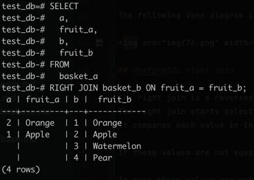
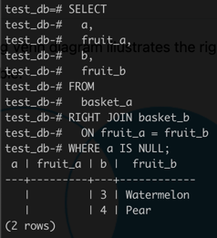
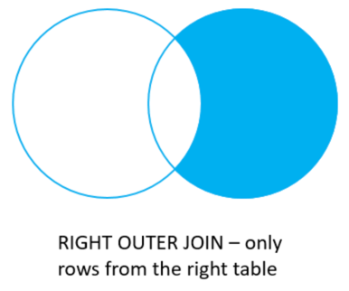

# PostgreSQL right join

The right join is a reversed version of the left join.
The right join starts selecting data from the right table.
It compares each value in the `fruit_b` column of every row in the right table (`basket_b`) with each value in the `fruit_a` column of every row in the left table (`basket_a`).

If these values are equal, the right join creates a new row that contains columns from both tables.

In case these values are not equal, the right join also creates a new row that contains columns from both tables.
However, it fills the columns in the left table with `NULL`.

The following statement uses the right join to join the `basket_a` table with the `basket_b` table.

```sql
SELECT
  a,
  fruit_a,
  b,
  fruit_b
FROM
  basket_a
RIGHT JOIN basket_b ON fruit_a = fruit_b;
```

Here is the output:



The following Venn diagram illustrates the right join:


Similarly, you can get rows from the right table that do not have matching rows from the left table by adding a `WHERE` clause as follows:

```sql
SELECT
  a,
  fruit_a,
  b,
  fruit_b
FROM
  basket_a
RIGHT JOIN basket_b
  ON fruit_a = fruit_b
WHERE a IS NULL;
```



> The `RIGHT JOIN` and `RIGHT OUTER JOIN` are the same therefore you can use them interchangeably.

The following Venn diagram illustrates the right join that returns rows from the right table that do not have matching rows in the left table.


