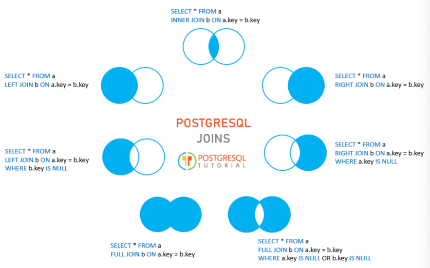

# PostgreSQL full outer join

The full outer join or full join returns a result set that contains all rows from both left and right tables, with the matching rows from both sides if available.
In case there is no match, the columns of the table will be filled with `NULL`.

```sql
SELECT
  a,
  fruit_a,
  b,
  fruit_b
FROM
  basket_a
FULL OUTER JOIN basket_b
  ON fruit_a = fruit_b;
```

Output:


The following Venn diagram illustrates the full outer join:


To return rows in a table that do not have matching rows in the other, you use the full join with a `WHERE` clause:

```sql
SELECT
  a,
  fruit_a,
  b,
  fruit_b
FROM
  basket_a
FULL JOIN basket_b
  ON fruit_a = fruit_b
WHERE a IS NULL OR b IS NULL;
```


The following Venn diagram illustrates the full outer join that returns rows from a table that do not have the corresponding rows in the other table.


The following picture shows all the PostgreSQL joins discussed so far with the detailed syntax:


