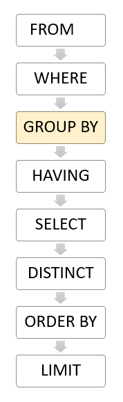
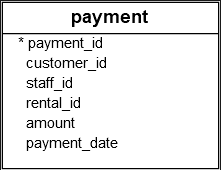

# PostgreSQL `GROUP BY`

**Summary**: In this section, you will learn how to use PostgreSQL `GROUP BY` clause to divide rows into groups.

## Introduction to PostgreSQL `GROUP BY` Clause

The `GROUP BY` clause divides the rows returned from the `SELECT` statement into groups.

For each group, you can apply an aggregate function such as `SUM()` to calculate the sum of items or `COUNT()` to get the number of items in the groups.

### Syntax of the `GROUP BY` Clause

The following illustrates the basic syntax of the `GROUP BY` clause:

```sql
SELECT
    column_1,
    column_2
    ...,
    aggregate_function(column_3)
FROM
    table_name
GROUP BY
    column_1,
    column_2,
    ...;
```

In this syntax:

- First, select the columns that you want to group such as `column_1` and `column_2`, and the column on which you'd like to apply an aggregate function (e.g., `column_3`).
- Second, list the columns that you want to group in the `GROUP BY` clause.

The `GROUP BY` clause divides the rows by the values in the columns specified in the `GROUP BY` clause and calculates a value for each group.

It's possible to use other clauses of the `SELECT` statement with the `GROUP BY` clause.

PostgreSQL evaluates the `GROUP BY` clause after the `FROM` and `WHERE` clauses and before the `HAVING`, `SELECT`, `DISTINCT`, `ORDER BY`, and `LIMIT` clauses.



## PostgreSQL `GROUP BY` Clause Examples

Let's take a look a the `payment` table in the sample database.



### 1. Using PostgreSQL `GROUP BY` Without an Aggregate Function

The following example uses the `GROUP BY` clause to retrieve the `customer_id` from the payment table:

```sql
SELECT
    customer_id
FROM
    payment
GROUP BY
    customer_id
ORDER BY
    customer_id;
```

Output:

```
 customer_id
-------------
           1
           2
           3
           4
           5
           6
           7
           8
...
```

Each customer has one or more payments.
The `GROUP BY` clause removes duplicate values in the `customer_id` column and returns distinct customer IDs.
In this example, the `GROUP BY` clause works like the `DISTINCT` operator.

### 2. Using PostgreSQL `GROUP BY` with the `SUM()` Function

The `GROUP BY` clause is useful when used in conjunction with an aggregate function.

The following query uses the `GROUP BY` clause to retrieve the total payment paid by each customer.

```sql
SELECT
    customer_id,
    SUM(amount),
FROM
    payment
GROUP BY
    customer_id
ORDER BY
    customer_id;
```

Output:

```
 customer_id |  sum
-------------+--------
           1 | 114.70
           2 | 123.74
           3 | 130.76
           4 |  81.78
           5 | 134.65
           6 |  84.75
           7 | 130.72
...
```

In this example, the `GROUP BY` clause groups the payments by the customer ID.
For each group, it calculates the total payment.

The following statement uses the `ORDER BY` clause with the `GROUP BY` clause to sort the groups by total payments:

```sql
SELECT
    customer_id,
    SUM(amount)
FROM
    payment
GROUP BY
    customer_id
ORDER BY
    SUM(amount) DESC;
```

Output:

```
 customer_id |  sum
-------------+--------
         148 | 211.55
         526 | 208.58
         178 | 194.61
         137 | 191.62
         144 | 189.60
```

### 3. Using the PostgreSQL `GROUP BY` Clause with the `JOIN` Clause

The following statement uses the `GROUP BY` clause to retrieve the total payment for each customer and display the customer name and amount:

```sql
SELECT
    first_name || ' ' || last_name full_name,
    SUM(amount) amount
FROM
    payment
    INNER JOIN customer USING (customer_id)
GROUP BY
    full_name
ORDER BY
    amount DESC;
```

Output:

```
       full_name       | amount
-----------------------+--------
 Eleanor Hunt          | 211.55
 Karl Seal             | 208.58
 Marion Snyder         | 194.61
 Rhonda Kennedy        | 191.62
 Clara Shaw            | 189.60
...
```

In this example, we join the `payment` table with the `customer` table using an inner join to get the customer names and group customers by their names.

### 4. Using PostgreSQL `GROUP BY` with the `COUNT()` Function

The following example uses the `GROUP BY` clause with the `COUNT()` function to count the number of payments processed by each staff:

```sql
SELECT
    staff_id,
    COUNT(payment_id)
FROM
    payment
GROUP BY
    staff_id;
```

Output:

```
 staff_id | count
----------+-------
        1 |  7292
        2 |  7304
(2 rows)
```

In this example, the `GROUP BY` clause divides the rows in the `payment` table into groups and groups them by value in the `staff_id` column.
For each group, it counts the number of rows using the `COUNT()` function.

### 5. Using PostgreSQL `GROUP BY` with Multiple Columns

The following example uses `GROUP BY` clause to group rows by values in two columns:

```sql
SELECT
    customer_id,
    staff_id,
    SUM(amount)
FROM
    payment
GROUP BY
    staff_id,
    customer_id
ORDER BY
    customer_id;
```

Output:

```
 customer_id | staff_id |  sum
-------------+----------+--------
           1 |        2 |  53.85
           1 |        1 |  60.85
           2 |        2 |  67.88
           2 |        1 |  55.86
           3 |        1 |  59.88
...
```

In this example, the `GROUP BY` clause divides the rows in the `payment` table by the values in the `customer_id` and `staff_id` columns.
For each group of `(customer_id, staff_id)`, the `SUM()` function calculates the total amount.

### 6. Using PostgreSQL `GROUP BY` Clause with a Date Column

The following example uses the `GROUP BY` clause to group the payments by payment date:

```sql
SELECT
    payment_date::date payment_date,
    SUM(amount) sum
FROM
    payment
GROUP BY
    payment_date::date
ORDER BY
    payment_date DESC;
```

Output:

```
payment_date |   sum
--------------+---------
 2007-05-14   |  514.18
 2007-04-30   | 5723.89
 2007-04-29   | 2717.60
 2007-04-28   | 2622.73
...
```

Since the values in the `payment_date` column are timestamps, we cast them to date values using the cast operator `::`.

## Summary

Use the PostgreSQL `GROUP BY` clause to divide rows into groups and apply an aggregate function to each group.
