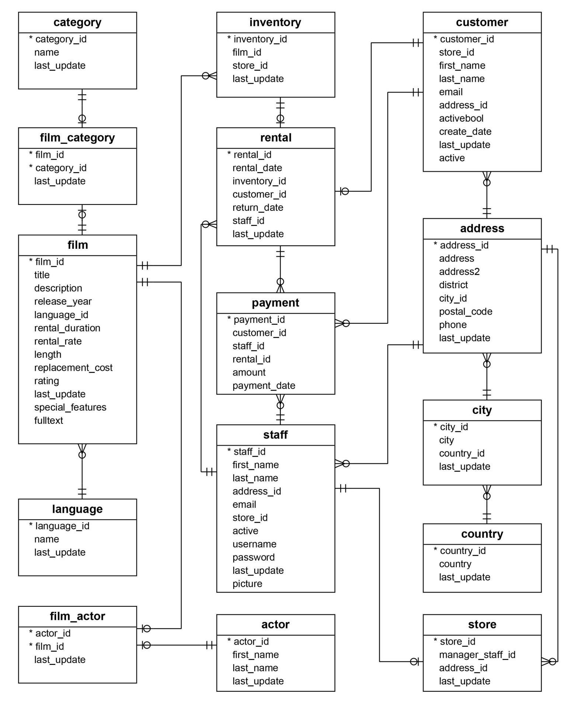

# postgresql-labs

PostgreSQL learning labs.

## Installation

This guide focuses on usage of PostgreSQL with macOS.

See the below links for installation instructions:

- https://www.postgresql.org/download/
- https://www.postgresql.org/docs/current/tutorial-install.html
- https://www.postgresql.org/docs/current/tutorial-start.html
- https://www.postgresqltutorial.com/postgresql-getting-started/install-postgresql-macos/

---

### PostgreSQL sample database tables

There are 15 tables **in the** DVD Rental database:

- actor - stores actors data including first name and last name.
- film - stores film data such as title, release year, length, rating, etc.
- film_actor - stores the relationships between films and actors.
- category - stores film's categories data.
- film_category - stores the relationships between films and categories.
- store - contains the store data including manager staff and address.
- inventory - stores inventory data.
- rental - stores rental data.
- payment - stores customer's payments.
- staff - stores staff data.
- customer - stores customer data.
- address - stores address data for staff and customers.
- city - stores city names.
- country - stores country names.

The sample database (`dvdrental`) is located in the `/resources` directory, in the parent directory of this project. 
