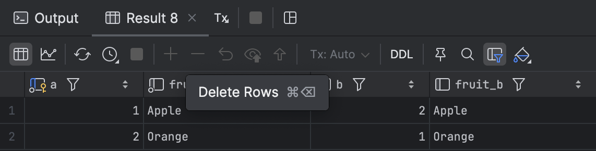

# Exercises: PostgreSQL Inner Join

### Exercise 1: Inner Join

**Objective**: Join `basket_a` and `basket_b` tables by matching the `fruit_a` and `fruit_b` columns.

**Task**: Use the `INNER JOIN` to match the columns.

```sql
SELECT a, fruit_a, b, fruit_b
FROM basket_a
INNER JOIN basket_b ON fruit_a = fruit_b;
```


